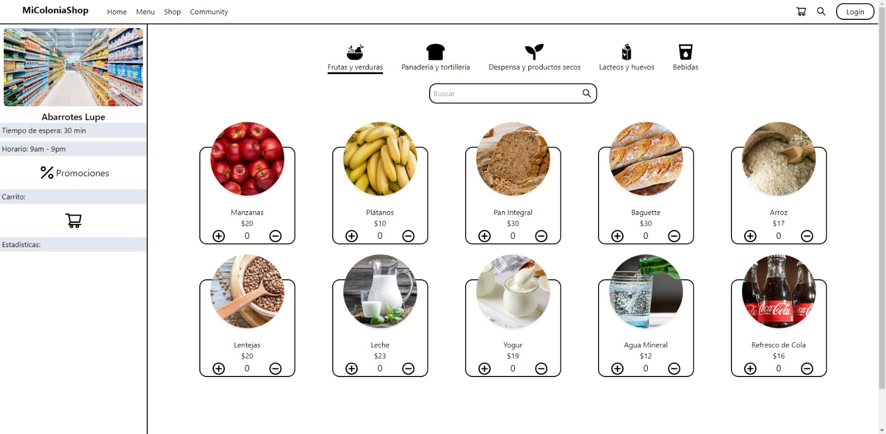

# MiColoniaShop-Prototype
MiColoniaShop is a web platform designed to connect people with local grocery stores and small businesses in their neighborhood. It simplifies the search and purchase of products from nearby stores, promoting support for local businesses and convenience for users.

## Features
- Browse and purchase products from various categories, including fruits and vegetables, bakery, dry goods, dairy, eggs, and beverages.
- Quick product search functionality.
- User-friendly and visually appealing interface.
- Integrates data from local store products.

## Screenshots

