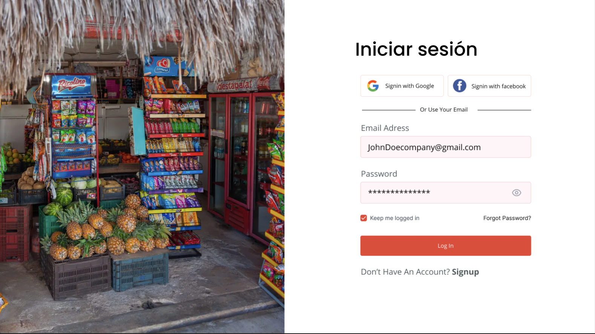

# MiColoniaShop
MiColoniaShop is a web platform tailored to empower local grocery stores and small businesses during challenging times, like the COVID-19 pandemic. It simplifies shopping for neighborhood products, promoting local business sustainability and user convenience.

## Purpose
In the wake of COVID-19, the local grocery sector faced significant hardships, with about 45% of stores closing and a 25% revenue decline. MiColoniaShop responds to this crisis by offering an online platform for these stores to continue operations, aiming to significantly reduce the closure rate and financial downturn. The implementation of MiColoniaShop is projected to not only halt but potentially reverse these negative trends, offering a lifeline to struggling local businesses.

## Key Features
* Diverse product categories including fruits, vegetables, bakery, dry goods, dairy, and beverages.
* Efficient product search functionality.
* Intuitive and attractive user interface.
* Real-time inventory integration from local stores.

## Technology Stack:

* Next.js: For comprehensive web and mobile application development.
* Tailwind CSS: For responsive design, ensuring an engaging user experience.
* Supabase: For advanced PostgreSQL database management, authentication, and API services.

## Contribution:

The introduction of MiColoniaShop is expected to positively impact the affected percentages, leading to a decrease in the rate of store closures and financial losses within the local grocery sector. 

## Web Page

  

